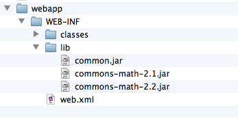

gradle-web-multiproject-sample
==============================

This Gradle Project Constists of two projects.

- __webapp__ produces a war
- __common__ produces a jar and is required by __webapp__

The Problem:
=======

__webapp__ requires ````common-math 2.2```` and __common__ has an older version of that: ````common-math 2.1````


Gradle itself nows that common-math 2.2 overwrites 2.1

	compile - Compile classpath for source set 'main'.
	+--- org.apache.commons:commons-math:2.2
	+--- master:common:unspecified
	|    \--- org.apache.commons:commons-math:2.1 -> 2.2
	\--- javax.servlet:servlet-api:2.5

	default - Configuration for default artifacts.
	+--- org.apache.commons:commons-math:2.2
	+--- master:common:unspecified
	|    \--- org.apache.commons:commons-math:2.1 -> 2.2
	\--- javax.servlet:servlet-api:2.5

	providedCompile - Additional compile classpath for libraries that should not be part of the WAR archive.
	\--- javax.servlet:servlet-api:2.5

	providedRuntime - Additional runtime classpath for libraries that should not be part of the WAR archive.
	\--- javax.servlet:servlet-api:2.5

	runtime - Runtime classpath for source set 'main'.
	+--- org.apache.commons:commons-math:2.2
	+--- master:common:unspecified
	|    \--- org.apache.commons:commons-math:2.1 -> 2.2
	\--- javax.servlet:servlet-api:2.5


__But when gradle generates the eclipse files__ and you deploy the webapp to a tomcat in eclipse, the deployment folder looks like that:

